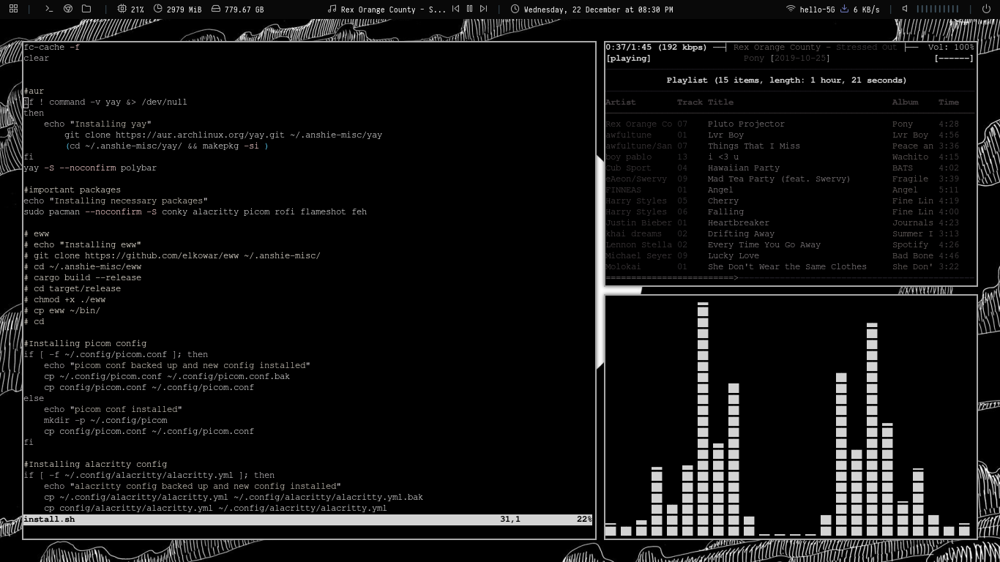

<h1 align="center">✨ i3-gaps dotfiles ✨</h1>


## Contents

- [Contents](#contents)
- [What is this?](#what-is-this)
- [Packages and features?](#packages-and-features)
- [PREVIEW OF WHAT YOULL GET!](#preview-of-what-youll-get)
- [Keybinds](#keybinds)

<a id="about"></a>

## What is this?
Welcome!

This is an i3-gaps rice with a monochromatic theme.

You want to get these, I know ;) check the Install Tutorial below.
If you're here just to view them, here are the screenshots:





<a id="package"></a>

## Packages and features?
- **i3-gaps**
- **Terminal:** Alacritty with a monochromatic theme.
- **Rofi:** A better dmenu (dmenu replacement).
- **Polybar:** The god of bars (according to me atleast)
- **Dunst:** A light and pretty notification daemon.
- **Light on your setup:**  A normal install with arch takes just 35 extra megabytes.
- **Conky:** A pretty clock on your desktop
- **INSTALL IT NOW!!**


<a id="action"></a>

## PREVIEW OF WHAT YOULL GET!

<p align="center">
    
</p>


<a id="install"></a>
## Installation tutorial (only for arch-based distros as of now)
heres the juice :)

this thing makes backups of your stuff too btw

Install git
`pacman -Sy git`

```sh
git clone https://github.com/Anshieee/i3-mono.git
cd i3-mono.git
chmod +x install.sh
./install.sh
```

<a id="keybinds"></a>
## Keybinds 

Common keybinds. All the keybinds are listen in `~/.config/i3/config`

|        Keybind         |                 Function                 |
| ---------------------- | ---------------------------------------- |
| `Mod+ Enter`          | Launch Alacritty                         |
| `Mod+ Shift + Q`      | Close window                             |
| `Mod+ Space`          | Open rofi menu                           |
| `Mod+ Tab`            | Open rofi tab switcher                   |
| `Mod+ F`              | Toggle fullscreen                        |
| `Mod+ Shift + Space`  | Toggle tiling/floating                   |
| `Mod+ Shift + Arrow keys`| Navigate through windows              |
